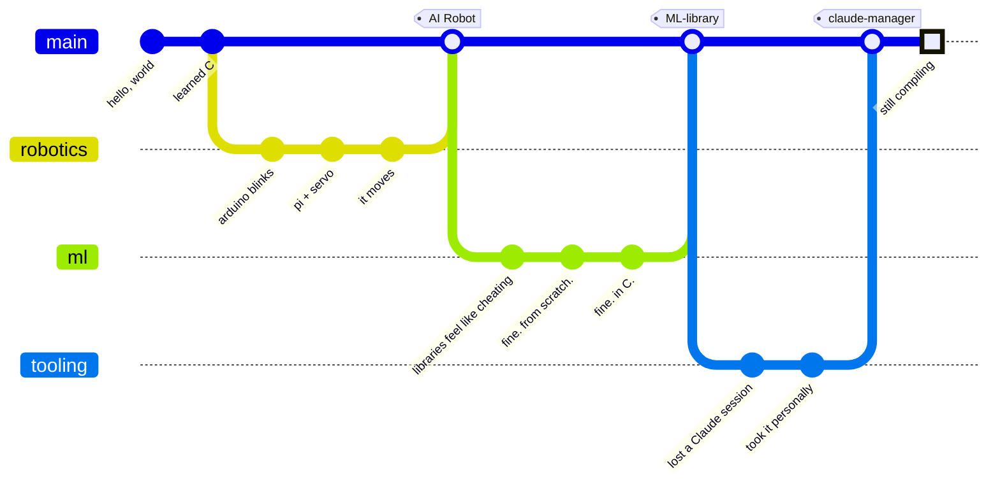

<!--
 ═══════════════════════════════════════════════════════════════════════════
  AlexanderGese/AlexanderGese — profile README
  Structured as man alexander(1).

  RELIABILITY RULE, obeyed throughout:
    · Anything that reads the GitHub API is generated by an Action in THIS
      repo (snake, 3D calendar, activity feed, papers). It cannot rate-limit.
    · Anything hotlinked is a stateless SVG service with no GitHub API call
      (shields, skillicons, capsule-render, typing-svg). It cannot rate-limit.
    · The two stat cards that MUST hit the API point at YOUR OWN Vercel
      instance. Deploy it once — see SETUP.md — then replace STATS_HOST below.

  Find/replace STATS_HOST with your instance hostname after deploying.
 ═══════════════════════════════════════════════════════════════════════════
-->

<div align="center">


<br/>

<a href="https://linkedin.com/in/alexander-gese"></a>
<a href="https://x.com/DevLsx"></a>
<a href="https://buymeacoffee.com/alexandergese"></a>
<a href="https://github.com/AlexanderGese?tab=followers"></a>


</div>

```troff
ALEXANDER(1)                   User Commands                   ALEXANDER(1)
```

## `NAME`

```text
alexander — aspiring computer scientist; builds machines that learn,
            then rebuilds them in C for reasons nobody has established
```

## `SYNOPSIS`

```text
alexander [--ml] [--robotics] [--research] [--automate THING]
          [-j$(nproc)] [--rewrite-in-c] [--no-sleep] [--ship]
```

## `DESCRIPTION`

```text
Based in Germany, UTC+1. Runs one persistent foreground process
(curiosity) and an unbounded number of zombie processes (side projects)
that were spawned, never reaped, and still hold file descriptors.

Holds the Pair Extraordinaire achievement. The pair is a language model.
This is either the future of software or a cry for help; the commit log
declines to specify.
```

## `OPTIONS`

```text
--ml              Machine learning, implemented from scratch. The
                  existing libraries were too helpful and I resented it.

--robotics        Arduino, Raspberry Pi, and one servo that makes a
                  noise I have chosen not to investigate.

--research        Reads papers. Understands approximately one in three.
                  Cites the other two anyway.

--automate THING  Automates THING instead of doing THING.
                  Net time saved to date: -14 hours.

--rewrite-in-c    Auto-loaded at boot. Cannot be disabled. Do not file
                  a bug about this; it is documented behaviour.

--no-sleep        Default. See BUGS.

--ship            Rarely combined with --rewrite-in-c. Working on it.
```

## `EXIT STATUS`

```text
  0    shipped
  1    "works on my machine"
  2    scope creep
 130   SIGINT at 03:47, voluntarily
 139   segmentation fault (core dumped)  — see BUGS
 143   SIGTERM from real life
```

## `FILES`

<table>
<tr><td width="34%"><b><a href="https://github.com/AlexanderGese/claude-manager">claude-manager</a></b><br/><sub>TypeScript</sub></td><td>Resume any past Claude Code session from anywhere. Fuzzy TUI, custom names, time-bucketed history, one-key resume in the original directory. Built because I lost a session once and took it personally.</td></tr>
<tr><td><b><a href="https://github.com/AlexanderGese/ML-library">ML-library</a></b><br/><sub>C</sub></td><td>Machine learning primitives with manual memory management and no safety net. The gradients are correct. The <code>free()</code> calls are mostly correct.</td></tr>
<tr><td><b>AI Robot</b><br/><sub>C++ · Python · solder</sub></td><td>A full AI-powered robot, from scratch. Currently on epoch 1,204. Nobody remembers starting the training loop.</td></tr>
<tr><td><b>Focus Mode</b><br/><sub>browser extension</sub></td><td>Reduces digital distractions. Written during a period of significant digital distraction.</td></tr>
<tr><td><b>Daily Dev News</b><br/><sub>automation</sub></td><td>Automated tech news to your inbox, so I can stop opening 147 tabs. I now open 147 tabs <i>and</i> read the email.</td></tr>
<tr><td><b>Research papers</b><br/><sub>LaTeX · caffeine</sub></td><td>AI and CS. In progress, permanently.</td></tr>
</table>

## `HISTORY`



## `ENVIRONMENT`

<div align="center">

<sub><b>the ones I reach for first</b></sub><br/>


<sub><b>everything else on <code>$PATH</code></b></sub><br/>


<sub><b>web · data · runtime</b></sub><br/>


<sub><b>infra · tooling</b></sub><br/>


<sub><b>things with pins on them</b></sub><br/>


</div>

## `DIAGNOSTICS`

<div align="center">

<!-- ┌──────────────────────────────────────────────────────────────────┐
     │ These two cards are the ONLY things here that hit the GitHub API.│
     │ Deploy your own instance (SETUP.md, 4 min) and find/replace      │
     │ STATS_HOST → your-instance.vercel.app. Then they never break.    │
     └──────────────────────────────────────────────────────────────────┘ -->

<picture>
  <source media="(prefers-color-scheme: dark)" srcset="https://STATS_HOST/api?username=AlexanderGese&show_icons=true&include_all_commits=true&count_private=true&hide_border=true&rank_icon=github&bg_color=070B14&title_color=22D3EE&icon_color=22D3EE&text_color=C9D9E4&custom_title=diagnostics"/>
  
</picture>
<picture>
  <source media="(prefers-color-scheme: dark)" srcset="https://STATS_HOST/api/top-langs/?username=AlexanderGese&layout=compact&langs_count=8&hide_border=true&bg_color=070B14&title_color=22D3EE&text_color=C9D9E4&custom_title=linked+libraries"/>
  
</picture>

<br/><br/>


<sub>


<br/>
<i>YOLO: merged without review. Quickdraw: closed an issue in under five minutes.<br/>Pair Extraordinaire: co-authored commits, mostly with something that doesn't sleep either.</i>
</sub>

</div>

## `STANDARD OUTPUT`

<!-- ═══ Action-generated. Zero external dependencies. Cannot rate-limit. ═══ -->

<div align="center">

<picture>
  <source media="(prefers-color-scheme: dark)" srcset="https://raw.githubusercontent.com/AlexanderGese/AlexanderGese/output/snake-dark.svg"/>
  <source media="(prefers-color-scheme: light)" srcset="https://raw.githubusercontent.com/AlexanderGese/AlexanderGese/output/snake.svg"/>
  
</picture>


</div>

## `SEE ALSO — recent activity`

<!--START_SECTION:activity-->
<!-- github-activity-readme writes here. Empty until the Action runs once. -->
<!--END_SECTION:activity-->

## `SEE ALSO — currently on the reading pile`

<sub>auto-pulled from arXiv <code>cs.RO</code> and <code>cs.LG</code>. I have read some of these.</sub>

<!-- BLOG-POST-LIST:START -->
<!-- blog-post-workflow writes here. Empty until the Action runs once. -->
<!-- BLOG-POST-LIST:END -->

## `EXAMPLES`

> You open an unmaintained repository. Something is humming.
> It should not be humming.

<details>
<summary><b>&nbsp;▸&nbsp; <code>cd ./unmaintained && ls -la</code></b></summary>
<blockquote>
A Raspberry Pi is taped to a servo. A monitor shows a training loop on epoch
<b>1,204</b>. <code>loss: 0.0000</code>. <code>val_loss: NaN</code>.
<br/><br/>
The last commit message is <code>fix: it works now (do not touch)</code>.
</blockquote>

<details>
<summary><b>&nbsp;&nbsp;&nbsp;&nbsp;▸&nbsp; <code>./robot --interrogate</code></b></summary>
<blockquote>
It turns to face you.<br/><br/>
<i>"I have learned everything,"</i> it says. <i>"None of it generalises."</i>
</blockquote>

<details>
<summary><b>&nbsp;&nbsp;&nbsp;&nbsp;&nbsp;&nbsp;&nbsp;&nbsp;▸&nbsp; <code>kill -15 $(pidof robot)</code></b></summary>
<blockquote>
<b>ENDING 1 — "Early Stopping."</b><br/>
The humming stops. You sleep for eight consecutive hours and wake up frightened.<br/>
<code>🏆 unlocked: knows when to quit</code>
</blockquote>
</details>

<details>
<summary><b>&nbsp;&nbsp;&nbsp;&nbsp;&nbsp;&nbsp;&nbsp;&nbsp;▸&nbsp; <code>./robot --add-layers 12</code></b></summary>
<blockquote>
<b>ENDING 2 — "Scaling Laws."</b><br/>
The loss goes down. The power bill goes up. The robot now writes poetry in C,
with manual memory management. One of the poems has a use-after-free and it is
the best thing either of you has produced.<br/>
<code>🏆 unlocked: more is more</code>
</blockquote>
</details>
</details>

<details>
<summary><b>&nbsp;&nbsp;&nbsp;&nbsp;▸&nbsp; <code>git log --oneline</code></b></summary>
<pre><code>a3f10c2  fix: it works now (do not touch)
9e2bb47  refactor: rewrite in C
71cd90a  refactor: rewrite in C, properly
4b0e155  revert: "refactor: rewrite in C, properly"
c81a6f9  feat: add tests
2d47e30  fix: remove tests
8f4c1ab  Co-authored-by: an LLM that also does not sleep
0000000  Initial commit</code></pre>
<blockquote>
<b>ENDING 3 — "Git Archaeology."</b><br/>
You understand nothing but you feel closer to the author.<br/>
<code>🏆 unlocked: git blame is a mirror</code>
</blockquote>
</details>
</details>

<details>
<summary><b>&nbsp;▸&nbsp; <code>cd ~ && exit</code></b></summary>
<blockquote>
Wise. You go outside. The sun is real and it is warm.<br/>
Behind you, faintly, the loop reaches epoch 1,205.<br/>
<code>🏆 unlocked: work-life balance (mythical)</code>
</blockquote>
</details>

## `BUGS`

```text
· Cannot leave a working system alone.
· Refactors code with zero users, for the users.
· "I'll just add one more feature" — recursive, no base case.
· sleep_schedule.conf: No such file or directory. Continuing anyway.
· Starts project N+1 while project N is at 94%.

Report bugs to:  github.com/AlexanderGese/AlexanderGese/issues
Patches welcome. Tests optional, historically.
```

## `SEE ALSO`

<div align="center">

<a href="https://github.com/AlexanderGese?tab=repositories"></a>
<a href="https://linkedin.com/in/alexander-gese"></a>
<a href="https://x.com/DevLsx"></a>
<a href="https://buymeacoffee.com/alexandergese"></a>

<sub><code>malloc(3), free(3), valgrind(1), sleep(3) — deprecated, no replacement</code></sub>


</div>

<div align="center">
<sub>

`ALEXANDER(1)` · Germany, UTC+1 · *I may be slow to respond, but I do respond*

</sub></div>
